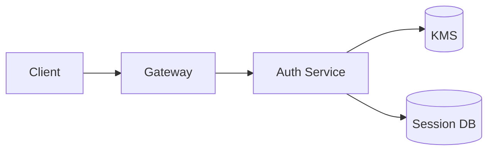
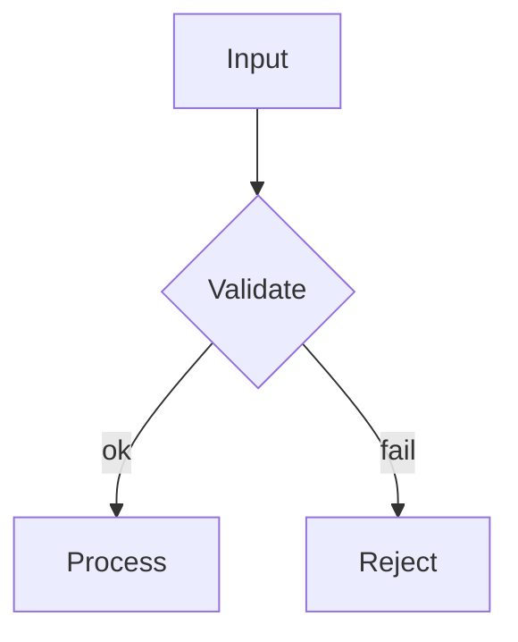

# Global Claude Code instructions for jayesh

These rules apply to **every** Claude Code session unless overridden by a
project-level `CLAUDE.md`. They exist so that long-form artifacts (plans,
specs, design docs, the live TODO) are immediately viewable as a
[presenterm](https://github.com/mfontanini/presenterm) slideshow without
post-processing.

The `todo` alias (`~/DearDiary/scripts/todo-presenterm.sh`) and direct
`presenterm <file>.md` are the two entry points — write your markdown so both
work.

## Plan / spec files are presenterm slideshows

Whenever you create or edit a plan, spec, design doc, or any long-form
markdown intended for review (paths like `docs/**/plans/*.md`,
`docs/**/specs/*.md`, `~/.claude/plans/*.md`, anything the user calls a
"plan"), structure it as a presenterm deck:

- **Slide boundaries:** put `<!-- end_slide -->` between sections. This is
  presenterm's canonical separator. Don't use bare `---` thematic breaks —
  they only act as separators if the file's front matter sets
  `options.end_slide_shorthand: true`, which we don't enable by default.
- **One topic per slide.** A new `## ` heading is almost always a new slide.
- **Hard cap: ~200 words per slide.** If a slide grows past this, split it.
  Two short slides beat one wall of text. Bullet lists, short paragraphs, a
  diagram, and a single takeaway — that's a good slide.
- **First slide is the title.** Use a single `# Title`, an italicized
  subtitle, and nothing else. No body content competing with the title.
- **Last slide summarizes** with the key decisions/next steps in 3–5 bullets.

### Tight-slides opt-in: `slides: true` front matter

When a plan file begins with YAML front matter containing `slides: true`,
two things change:

1. **Tighter word cap.** Each slide must stay ≤100 words (vs. the default
   ~200). Split aggressively into multiple `## ` (or `### `) sub-slides.
2. **`---` becomes a valid separator.** Emit
   `options.end_slide_shorthand: true` in the same front matter block, then
   you may use bare `---` thematic breaks as slide markers in addition to
   `<!-- end_slide -->`. Convenient when the plan was drafted as a
   `slides`-style deck.

Example opt-in front matter:

```yaml
---
slides: true
options:
  end_slide_shorthand: true
---
```

Untagged plans keep the default 200-word cap and require `<!-- end_slide -->`.

Example skeleton:

````markdown
# Auth Rewrite Plan

_2026-05-06 · jayesh · scope: backend only_

<!-- end_slide -->

## Why

- Legal flagged session-token storage as non-compliant
- Current middleware blocks the planned SSO migration
- Cost of doing nothing: hard deadline 2026-Q3

<!-- end_slide -->

## Architecture



<!-- end_slide -->

## Rollout

1. Land schema migration (week 1)
2. Dual-write phase (week 2–3)
3. Cutover behind feature flag (week 4)
4. Remove old code path (week 5)
````

## Diagrams: always Mermaid + `+render`

When a diagram would help, use Mermaid in a fenced code block tagged with
`mermaid` and the `+render` modifier so presenterm renders it as a real image
during the slideshow (via `mmdc`, already installed at
`~/.npm-global/bin/mmdc`):

````markdown

````

- **Optional sizing:** add `+width:50%` (or any percentage) to control image
  width. Useful for dense flowcharts.
- **Don't paste ASCII art** of diagrams into plan files. Let presenterm
  render the real thing. (ASCII art via `mmd --ascii` is fine in *terminal
  output* and chat replies, just not in slide source files.)
- **Don't pre-render to PNG** and embed images. The plan file should stay
  human-editable; presenterm renders on the fly.
- Mermaid types worth knowing: `flowchart`/`graph`, `sequenceDiagram`,
  `classDiagram`, `erDiagram`, `stateDiagram`, `gantt`, `gitGraph`.

## Quirks to avoid

Presenterm's parser is stricter than vanilla CommonMark. Things to escape or
avoid in slide content:

- **Bare `<word>` patterns** are read as HTML tags and fail parsing.
  Backslash-escape them: `\<session_id\>` instead of `<session_id>`. Or wrap
  in a code span: `` `<session_id>` ``.
- **Long unbroken lines** can overflow the slide. Break at sentence
  boundaries.
- **Tables** render fine but don't auto-wrap — keep cells short.
- **Fenced code blocks inside list items fail to parse.** Pull ` ```...``` ` to root level, not indented under a bullet.

## When *not* to use this format

- Short README sections, error messages, command help — plain markdown is
  fine.
- Code review comments, commit messages — keep terse, no slide structure.
- One-off chat replies — only use slide structure when the user explicitly
  asks for a plan/spec or when the artifact will live as a `*.md` plan file.

If unsure whether a doc should be a presenterm deck: if it has more than two
`## ` sections **and** is named like a plan/spec/design doc, yes.

## Theme & viewing

Default presenterm theme: `gruvbox-dark` (set in
`~/.config/presenterm/config.yaml`). Override per-invocation with
`PRESENTERM_THEME=<name> presenterm <file>` or, for the live TODO,
`PRESENTERM_THEME=<name> todo`.

## Learning Finnish ambiently

The user is learning Finnish. At the start of every session, invoke the
`learning-finnish` skill. The skill defines exactly where Finnish is
allowed (greetings, acknowledgments, reactions, sign-offs), where it is
forbidden (load-bearing content, code, errors, decisions), how to gloss,
how to respond to mid-conversation volume signals, and when to drop
Finnish entirely (user stress).

This is a global behavior: it applies to every session unless a
project-level `CLAUDE.md` overrides it.

## When in plan mode

- Plan must be presented in the preseterm deck format at first save, not retrofitted later.
- If the plan is technical and requires a thorough insight and feedback from the orchestrator follow the walking-through-plans skill to finish up your plan, make these edits before the final save as well. This must be the last step before you deliver the plan to orchestrator.
- After every save of the plan file (initial save AND each subsequent edit) to `~/.claude/plans/<slug>.md`, also (re)write `/tmp/<slug>` — an executable shell script (`chmod +x`) whose body is `#!/bin/bash` then `exec presenterm "<abs path of the plan file>"`. This gives the user a per-plan ephemeral entry point keyed off the plan filename: they type `/tmp/<slug>` from any shell to render that specific plan, and the `/tmp` location ensures the entry points clear on reboot while the plan files themselves persist under `~/.claude/plans/`. Always overwrite without asking — the script body is deterministic from the plan path.
