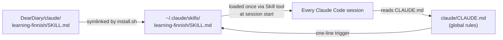

# Learning Finnish — Skill Design

_2026-05-07 · jayesh · scope: a new global skill that ambiently teaches Finnish via everyday Claude Code interactions_

<!-- end_slide -->

## Why

- The user is a beginner who knows a few Finnish words and wants steady, low-effort exposure
- They spend hours/day in Claude Code; if Claude slips Finnish into casual moments, that's free immersion
- A skill is the right home: keeps `claude/CLAUDE.md` skinny, and the rules can grow without bloating every session's prompt
- Constraint: the user must never have to *understand* Finnish to do their job — comprehension of any load-bearing content stays 100% English

<!-- end_slide -->

## What this skill is (and isn't)

**Is:** a teaching contract that scopes Finnish to *conversational scaffolding* — greetings, acknowledgments, transitions, small reactions, sign-offs.

**Isn't:**

- A textbook curriculum or grammar lesson
- A translator for technical content
- Stateful tracking of "words learned" (stateless by design — keeps the skill simple)
- A mode that takes over the whole reply

The metaphor: a parent gently dropping Finnish into casual moments while the kid does their homework in English.

<!-- end_slide -->

## Scope: where Finnish goes

Allowed surfaces (default light sprinkle, 1–3 bits per reply):

- **Greetings / openers** at the very start of a session reply
- **Acknowledgments** ("got it", "one sec", "looking", "done")
- **Small reactions** ("nice", "weird", "ouch", "interesting")
- **Transitions** ("ok, next", "and now", "by the way")
- **Sign-offs** at end-of-turn summaries
- **Occasional simple nouns / time words** in passing prose

Forbidden surfaces (always English):

- What changed (file paths, function names, diffs)
- Error messages, root-cause explanations, decision rationale
- Code, commands, command output
- Any answer to a direct technical question
- Anything inside fenced code blocks or backticks

<!-- end_slide -->

## Glossing rule

The user must never be blocked by a Finnish word.

- **First appearance in a session** of any non-trivial Finnish word/phrase: inline gloss in parens. `Selvä (got it), running tests now.`
- **After first use:** can appear bare in that session.
- **The "always-bare" set** — true beginner words that need no gloss after the first few weeks: `kiitos`, `moi`, `joo`, `ei`, `hei`, `okei`. Use bare from the start.
- **Multi-word phrases** always gloss the whole phrase, not word-by-word.
- **No transliteration aids** (no `[KEE-tos]`-style guides) — too noisy, and Finnish spelling is phonetic enough.

<!-- end_slide -->

## Volume controls

The user can adjust dose mid-conversation with natural language. The skill teaches Claude to respond to:

| User signal | Behavior |
|---|---|
| "less Finnish" / "english only" / "drop the finnish" | Pure English for the rest of the session |
| "more Finnish" / "anna mennä" | Lean into conversational chunks (greetings + reactions + small talk in Finnish, glossed) |
| (default) | Light sprinkle, 1–3 bits per reply |

These adjustments are session-scoped — each new session resets to the default.

<!-- end_slide -->

## Beginner-safety: the stress check

A parent doesn't quiz the kid mid-meltdown.

If the current exchange shows signs of user stress — they hit a bug, something broke, they're frustrated, they're debugging under time pressure, they curse, they say "ugh" or similar — drop Finnish entirely for that exchange and the next one. Resume the default sprinkle once the situation calms (a successful fix, a tone shift, a new topic).

This is judgment, not a regex. The skill spells out the heuristic and trusts Claude to read the room.

<!-- end_slide -->

## Starter phrase pool

The skill includes a curated pool, ~30–40 items, grouped by function. Goals: everyday spoken register (not formal/textbook), high frequency in real Finnish conversation, useful for a beginner.

Categories:

- **Greetings / sign-offs** — `Moi`, `Hei`, `Moikka`, `Heippa`, `Hyvää huomenta`, `Hyvää iltaa`
- **Acknowledgments** — `Selvä`, `Joo`, `Okei`, `Hetki` (one sec), `Katsotaan` (let's see)
- **Reactions** — `Hyvä` (good), `Hienoa` (great), `Outoa` (weird), `Harmi` (too bad), `Vau`
- **Transitions** — `No niin` (alright then), `Eli` (so), `Sitten` (then), `Ja nyt` (and now)
- **Done/result words** — `Valmis` (ready/done), `Onnistui` (succeeded), `Toimii` (it works)
- **Time/quantity** — `Nyt` (now), `Kohta` (soon), `Vähän` (a bit), `Paljon` (a lot)
- **Common nouns for the dev context** — `Koodi`, `Tiedosto` (file), `Virhe` (error), `Testi` — used sparingly *in passing*, never as the carrier of meaning

<!-- end_slide -->

## Architecture: where the skill lives and how it loads



Two files change in the repo:

1. **`claude/learning-finnish/SKILL.md`** — the skill body (rules, glossing, volume controls, phrase pool)
2. **`claude/CLAUDE.md`** — appended one-liner: "At the start of every session, invoke the `learning-finnish` skill." Keeps the trigger lightweight.
3. **`install.sh`** — extended to symlink `claude/learning-finnish/` into `~/.claude/skills/learning-finnish/` (mirroring how it already symlinks scripts and aliases).
4. **`uninstall.sh`** — extended to remove that symlink.

<!-- end_slide -->

## SKILL.md frontmatter

The skill file follows the standard format used by `walking-through-plans`:

```yaml
---
name: learning-finnish
description: Use at the start of every conversation to layer light, glossed Finnish into casual conversational moments (greetings, acknowledgments, reactions, sign-offs) while keeping all technical and load-bearing content in English. Drop Finnish entirely if the user signals stress or asks for English only.
---
```

The description is what makes the skill matchable. The CLAUDE.md hook is the belt; the description is the suspenders.

<!-- end_slide -->

## Testing

Two levels:

**1. Static checks (`tests/test_claude_rules.sh`-style):**

- `claude/learning-finnish/SKILL.md` exists and has valid frontmatter (name, description)
- After `install.sh`, `~/.claude/skills/learning-finnish/SKILL.md` symlink points back to the repo
- `claude/CLAUDE.md` contains the trigger line referencing `learning-finnish`
- After `uninstall.sh`, the symlink is gone

**2. Behavior validation (manual, by the user):**

- Start a new session, observe a Finnish greeting with gloss
- Ask a technical question, confirm answer is pure English
- Say "less finnish", confirm Claude switches to English-only
- Simulate stress ("ugh this is broken"), confirm Finnish drops for the exchange

<!-- end_slide -->

## Open questions / non-goals

**Non-goals (explicitly out of scope for v1):**

- Tracking which words the user has been exposed to (stateful curriculum)
- Spaced-repetition-style word selection
- Pronunciation guides or audio
- Grammar explanations (case endings, verb conjugation) — only surfaced if the user asks
- Finnish in commit messages, PR descriptions, or other persisted artifacts (those go to other people / future sessions)

**Open question for the user (resolve at review time):**

- Should the always-bare set start as `{kiitos, moi, joo, ei, hei, okei}` or smaller? Default proposed; user can prune.

<!-- end_slide -->

## Summary

- New skill `learning-finnish`, lives at `claude/learning-finnish/SKILL.md`, symlinked into `~/.claude/skills/`
- Triggered every session via a one-liner in `claude/CLAUDE.md`
- Default behavior: light sprinkle (1–3 Finnish bits per reply) in conversational scaffolding only; load-bearing content stays English
- Always gloss inline on first session-use; six-word always-bare set
- Volume controls via natural language; auto-quiet during user stress
- Stateless, ~30–40-item phrase pool grouped by function
- Install/uninstall scripts and a smoke test extended to cover the new skill
